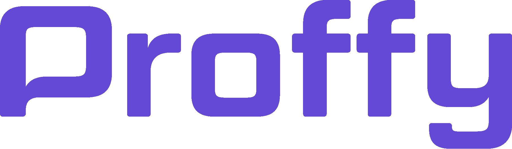
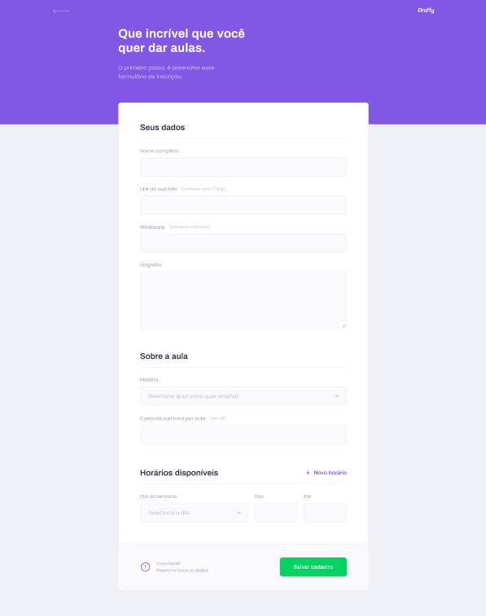
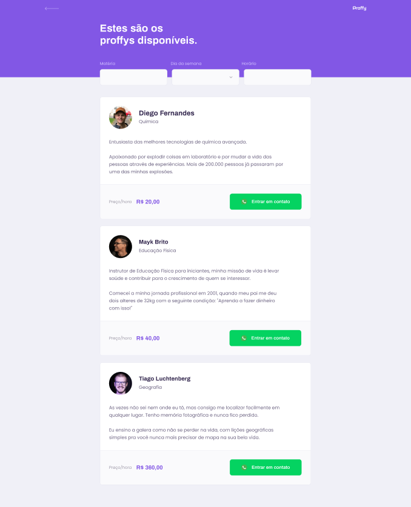
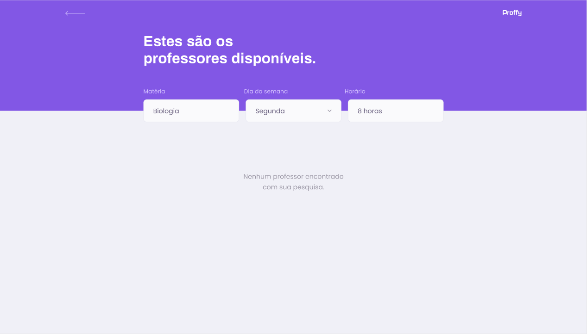

---

<a href='#nlw'>NLW </a>|
<a href='#proffy'>PROFFY </a>|
<a href='#functionalities'>FUNCIONALIDADES </a>|
<a href='#days'>DIAS </a>|
<a href='#tecnologies'>TECNOLOGIAS </a>|
<a href='#layout'>LAYOUT </a>|

## 
🚀 O que é a NLW ? 

Next Level Week é uma semana intensa com um propósito de desenvolver uma aplicação do mundo real fornecida pela RocketSeat, nessa edição foi desenvolvido o Proffy.

---

## 
📚 Proffy 

O Proffy é uma plataforma de estudos on-line, com intuito de conectar alunos e professores com o objetivo de ter aulas on-line.

---

## 
 ⚙ Funcionalidades 

1. Calendario das aulas.
2. O aluno pode entrar em contato com um professor específico.
3. Listas de professores disponíveis.
4. Campo de inscrição, para professores.

---

## 
📅 Dias 

#### 1. ✅ Acelerando sua evolução</li>

#### 2. 🚧 Olhando as oportunidades</li>

#### 3. 🚧 A escolha da stack</li>

#### 4. 🚧 Até 2 anos em 2 meses</li>

#### 5. 🚧 A milha extra</li>

---

## 
💻 Tecnologias 

<a href='https://pt-br.reactjs.org/'>React</a>
 
<a href='https://www.typescriptlang.org/'>TypeScript</a>
 
<a href='https://nodejs.org/en/download/'>Node.js</a>
 
<a href='https://reactnative.dev/'>React Native</a>
 

---

## 
🎨 Layout ? 

<a href='https://reactnative.dev/'>✍ Layout no Figma</a>

